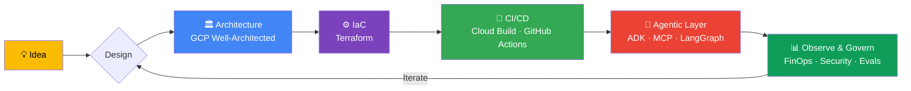

<div align="center">

<!-- Animated wave header -->


<!-- Typing animation -->
[](https://www.youtube.com/@techtrapture)

<br/>

<!-- Social badges -->
<a href="https://www.linkedin.com/in/vishal-bulbule/"></a>
<a href="https://www.youtube.com/@techtrapture?sub_confirmation=1"></a>
<a href="https://vishalbulbule.medium.com/"></a>
<a href="https://www.instagram.com/vishal_bulbule/"></a>
<a href="mailto:vishal.bulbule@techtrapture.com"></a>


</div>

---

## 🧭 About Me

```yaml
name: Vishal Bulbule
role: Founder @ TechTrapture — Agentic AI & Cloud Solutions consultancy
building:
  - Enterprise consulting — agentic AI architecture, agent systems, GCP FinOps
  - TechTrapture Academy — real-world learning built on live deployments
  - YouTube — 500+ production-grade tutorials, 22K+ engineers learning
recognitions:
  - Google Developer Expert (GDE)
  - Google Cloud Champion Innovator
  - 12x Google Cloud Certified
mission: "Making production-grade Cloud & AI skills accessible to every engineer"
fun_fact: "When not architecting clouds, I'm photographing them 📸"
```

---

## 🌐 TechTrapture — What I'm Building

**An Agentic AI & Cloud Solutions consultancy** — helping enterprises ship production-grade AI on Google Cloud, and teaching engineers from those real deployments.

| Pillar | What it does |
|--------|--------------|
| 🤝 **Consulting — Agentic AI & Cloud Solutions** | Agentic AI architecture, agent systems, data platforms, FinOps & security on GCP |
| 🎓 **TechTrapture Academy** | Real-world learning experience — cohort programs built on live deployments, not toy demos |
| 📺 **YouTube** | 500+ tutorials on ADK · MCP · Gemini · Vertex AI · BigQuery · FinOps |
| 🧪 **Build in Public** | Real systems, real deployments — shipped, documented, and taught |

---

## 🏗️ How I Build — My Architecture Philosophy



---

## 🛠️ Tech Arsenal

<div align="center">

### ☁️ Cloud & Infrastructure


### 💻 Languages & Data


### 🤖 AI Stack


</div>

---

## 📺 Latest YouTube Videos
<!-- YOUTUBE:START -->- 🎬 [Make Your First Gemini API Call in 10 Minutes  | Complete Beginner Guide](https://www.youtube.com/watch?v=UhMhJ1kYkc8) — Jun 11, 2026 
- 🎬 [Data Agent Kit Explained with Live Demo | Build Dataflow Pipelines](https://www.youtube.com/watch?v=INexjHUX1R0) — Jun 10, 2026 
- 🎬 [LLMs Explained in 20 Minutes | The Transformer Behind ChatGPT, Gemini &amp; Claude](https://www.youtube.com/watch?v=u8IQUowtxJo) — Jun 9, 2026 
- 🎬 [I Built a CloudOps Agent with Google ADK | Real-World Demo](https://www.youtube.com/watch?v=uYN8Y4lDk80) — Jun 5, 2026 
<!-- YOUTUBE:END -->

➡️ **[More videos on TechTrapture →](https://www.youtube.com/@techtrapture?sub_confirmation=1)**

## ✍️ Latest Blog Posts
<!-- BLOG-POST-LIST:START -->- ✍️ [Data Agent Kit - I Explored GCS, Visualized Data, and Built a Pipeline Without Leaving My Editor](https://medium.com/google-cloud/data-agent-kit-i-explored-gcs-visualized-data-and-built-a-pipeline-without-leaving-my-editor-e5277c452932?source=rss-ac9c985be096------2) — Jun 10, 2026 
- ✍️ [Agent Security Risks: Why AI Safety Guardrails Fail in Production](https://vishalbulbule.medium.com/agent-security-risks-why-ai-safety-guardrails-fail-in-production-1ff6aefecbdf?source=rss-ac9c985be096------2) — May 14, 2026 
- ✍️ [Why I Left My High paying Job — And What 2 Months Taught Me](https://vishalbulbule.medium.com/why-i-left-my-50-lpa-job-and-what-2-months-taught-me-24a80273cc32?source=rss-ac9c985be096------2) — May 14, 2026 
- ✍️ [The Hidden Cost of AI Agent Conversations: Token Math Every Team Gets Wrong](https://vishalbulbule.medium.com/the-hidden-cost-of-ai-agent-conversations-token-math-every-team-gets-wrong-8ba486c46de9?source=rss-ac9c985be096------2) — May 7, 2026 
<!-- BLOG-POST-LIST:END -->

➡️ **[More articles on Medium →](https://vishalbulbule.medium.com/)**

---

## 🚀 Featured Projects

| Project | Description | Stack |
|---------|-------------|-------|
| [🤖 Master Agentic AI with Google ADK](https://github.com/vishal-bulbule/Master-Agentic-AI-with-Google-ADK) | Production-grade agentic AI patterns with Google's Agent Development Kit | `ADK` `Gemini` `Python` |
| [⚙️ GKE CI/CD Pipeline](https://github.com/vishal-bulbule/gke-cicd) | Robust CI/CD for Kubernetes deployments on GKE | `GKE` `Cloud Build` `Docker` |
| [🔄 ETL with Data Fusion + Airflow](https://github.com/vishal-bulbule/etl-pipeline-datafusion-airflow) | End-to-end ETL using Data Fusion & Cloud Composer | `Data Fusion` `Airflow` `BigQuery` |
| [🏏 Cricket Stats Data Engineering](https://github.com/vishal-bulbule/cricket-stat-data-engineering-project) | Real-world data engineering project on live cricket data | `Python` `GCP` `Looker` |
| [🐍 Python for GCP](https://github.com/vishal-bulbule/Python-for-GCP) | Python automation recipes for Google Cloud | `Python` `Cloud SDK` |

---

## 📊 GitHub Analytics

<div align="center">


<!-- Contribution snake animation (light/dark aware) -->
<picture>
  <source media="(prefers-color-scheme: dark)" srcset="https://raw.githubusercontent.com/vishal-bulbule/vishal-bulbule/output/github-contribution-grid-snake-dark.svg" />
  
</picture>

</div>

---

## 🎓 Credentials

<details>
<summary><b>12x Google Cloud Certified + AWS + Terraform + Azure — expand to view all</b></summary>
<br/>
<div align="center">

[](https://www.credly.com/users/vishal-bulbule.591f486f/badges/credly)
[](https://www.credly.com/users/vishal-bulbule.591f486f/badges/credly)
[](https://www.credly.com/users/vishal-bulbule.591f486f/badges/credly)
[](https://www.credly.com/users/vishal-bulbule.591f486f/badges/credly)
[](https://www.credly.com/users/vishal-bulbule.591f486f/badges/credly)
[](https://www.credly.com/users/vishal-bulbule.591f486f/badges/credly)
[](https://www.credly.com/users/vishal-bulbule.591f486f/badges/credly)
[](https://www.credly.com/users/vishal-bulbule.591f486f/badges/credly)
[](https://www.credly.com/users/vishal-bulbule.591f486f/badges/credly)
[](https://www.credly.com/users/vishal-bulbule.591f486f/badges/credly)
[](https://www.credly.com/users/vishal-bulbule.591f486f/badges/credly)
[](https://www.credly.com/users/vishal-bulbule.591f486f/badges/credly)

[](https://www.credly.com/users/vishal-bulbule.591f486f/badges/credly)
[](https://www.credly.com/users/vishal-bulbule.591f486f/badges/credly)
[](https://www.credly.com/users/vishal-bulbule.591f486f/badges/credly)

</div>
</details>

🔗 **[Verify all credentials →](https://www.credly.com/users/vishal-bulbule.591f486f/badges/credly)**

---

<div align="center">

## 🤝 Work With Me

**TechTrapture** is an Agentic AI & Cloud Solutions consultancy — partnering with enterprises
to ship production-grade AI agents, data platforms, FinOps & security on Google Cloud.
For engineers, **TechTrapture Academy** turns that real client work into a real-world learning experience.

<a href="mailto:vishal.bulbule@techtrapture.com"></a>

<br/><br/>

*"Learn, work and share knowledge!"*


</div>

<meta name="google-site-verification" content="Wnq1_CIje1PNiYPnssPg8_eQdAyOsDXWJiZ-Lwpxrks" />
